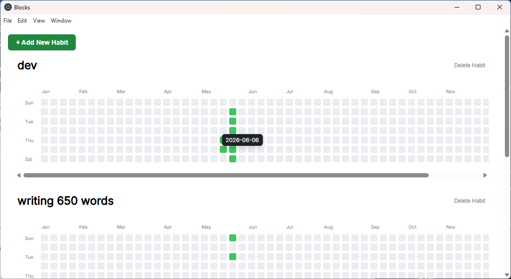

# Blocks : Habit Tracker

A minimalist desktop habit tracker built with **Electron**. Track your daily routines through an interactive calendar grid that persists your data locally.

## ✨ Features

* 📊 **Interactive Calendar Grid:** Click individual dates to quickly toggle completion states.
* ➕ **Dynamic Habit Management:** Add new habit cards instantly or remove.
* ✏️ **Inline Editing:** Click and type directly on any habit header to rename it on the fly.
* 💾 **Local Data Persistence:** Driven by `electron-store`—no complicated setups or external cloud databases required.
* 💭 **Contextual Tooltips:** Hover over tracking nodes to check date parameters instantly.

## 🛠️ Tech Stack

* **Frontend:** Vanilla JavaScript, HTML5, CSS3 (Flexbox/CSS Grid)
* **Backend Runtime:** Electron.js
* **Storage Wrapper:** `electron-store`

